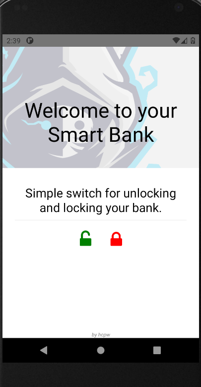

# React Native - AWS IoT - Raspberry Pi 4   
Development time: `react 16.13.1` `react-native: 0.63.4`   

## Usage  
`git clone https://github.com/ollolollollooloo/react-native-aws-iot-raspberry-pi-4.git`  
`cd react-native-aws-iot-raspberry-pi-4`  
`vim .env`  

add this in .env:  
```
REACT_APP_IDENTITY_POOL_ID=ph-manila-2:*****-*****-*****-*****-*****  
REACT_APP_REGION=ph-manila-2  
REACT_APP_USER_POOL_ID=ph-manila-2_*****  
REACT_APP_USER_POOL_WEB_CLIENT_ID=*************************  
REACT_APP_MQTT_ID=*****-ats  
```

`yarn install`  
`yarn add aws-amplify`  
`npx react-native run-android`   

## UI  
  

## Gallery  
https://github.com/ollolollollooloo/react-native-aws-iot-raspberry-pi-4/tree/main/gallery    
  
## In React Native  
I run this program in Windows 10 and Android Studio  
Using Amplify  
Publish to Channel  

## In AWS  
I setup IoT thing, IAM role, Cognito User Pool, Cognito Identity Pool and Amplify  

## In Raspberry Pi 4  
Solenoid Lock-style 12v  
Module Relay  
12v plug  
Using Python library provided by Amazon  
Subscribe to Channel  

By Following this Tutorial  
[Youtube Tutorial Soon]  

This is still in development....  
